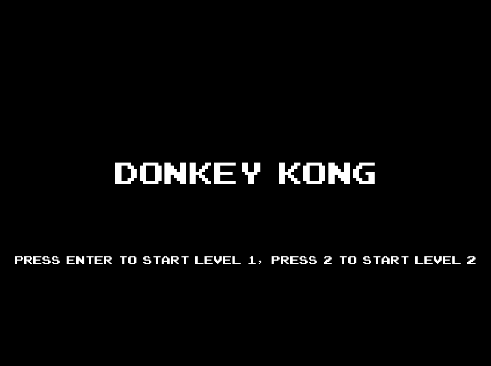
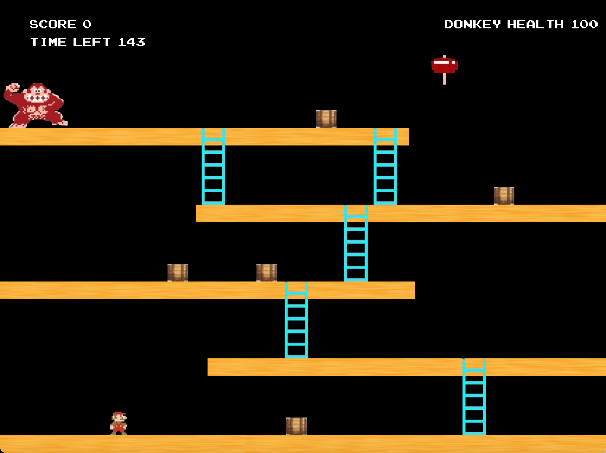
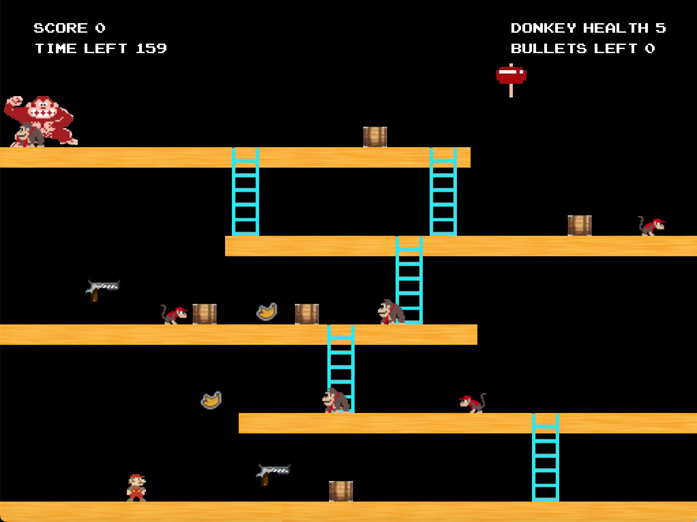
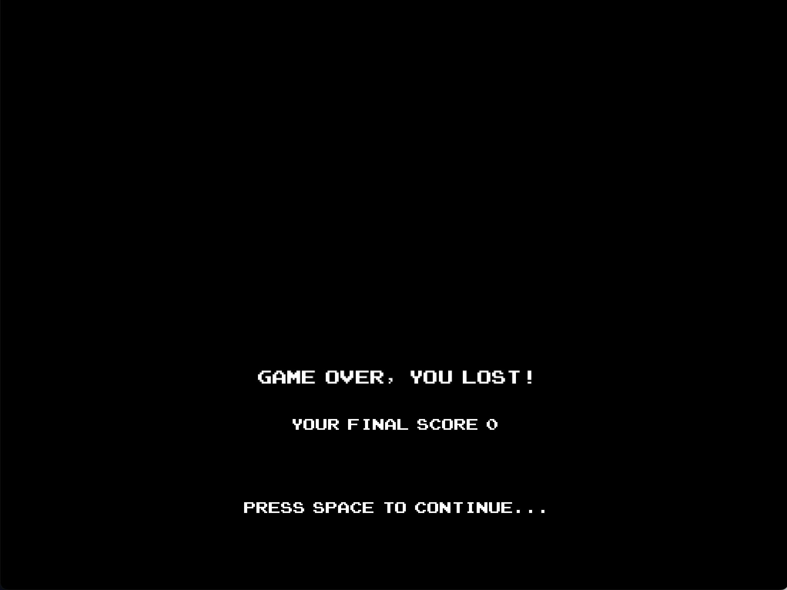
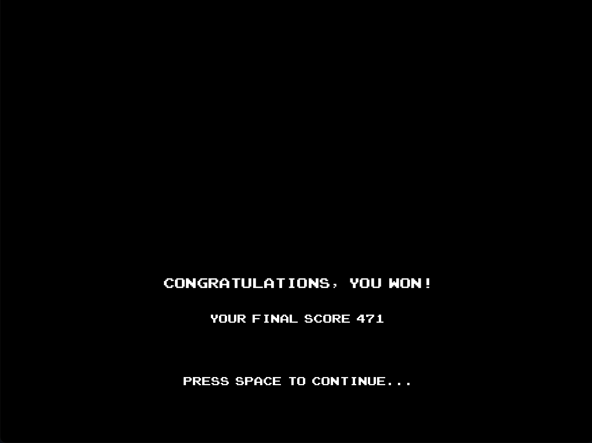
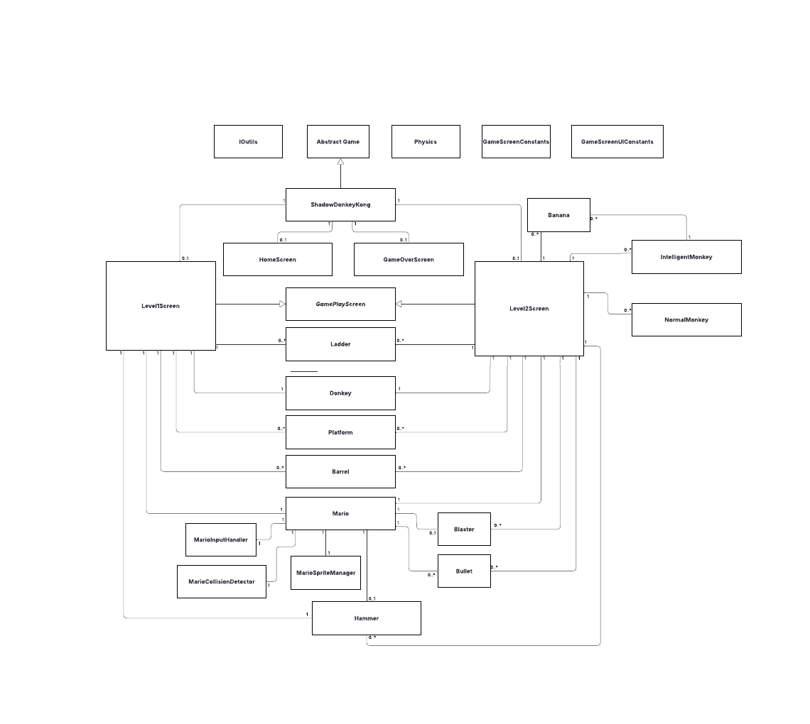
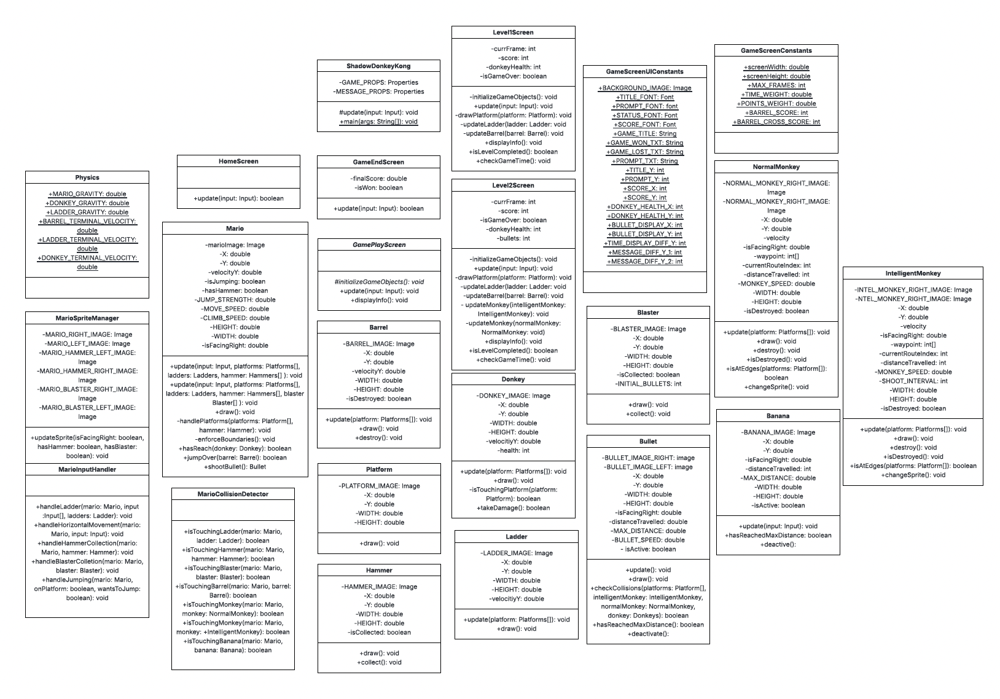

# 📍Donkey Kong & Mario Platformer Game

A two-level Java platformer game inspired by Donkey Kong, built using the **Bagel** game library. The game applies object-oriented design principles and was planned using UML diagrams.

---

## 📚 Table of Contents

- [📌 Overview](#-overview)
- [🎮 Game Guide](#-game-guide)
- [🧩 Features](#-features)
- [🖼 Screenshots](#-screenshots)
- [▶️ How to Run](#️-how-to-run)
- [🧪 Technologies Used](#-technologies-used)
- [🗂 UML & Design](#-uml--design)
- [🌟 Credits](#-credits)

---

## 📌 Overview

Shadow Donkey Kong is a Java-based 2D platformer where players control Mario, navigating through ladders, platforms, and hazards to defeat Donkey Kong using a hammer — all before time runs out. The game has **two unique levels** and a game over screen.

---

## 🎮 Game Guide

### 🔹 Objective
Defeat Donkey Kong by reaching him while holding a hammer. Avoid falling or running out of time.

### 🔹 Features

- 🟦 **Platforming mechanics** – Walk, jump, and land on platforms.
- 🪜 **Ladder climbing** – Climb up/down ladders for vertical movement.
- 🔨 **Hammer pickup** – Grab a hammer to defeat Donkey Kong.
- ⏱ **Time limit** – Complete each level before time runs out.

### 🔹 How to Play

1. **Start the game** – Launch and begin from the Home screen.
2. **Move Mario** – Use `←` `→` to move, and `Space` to jump.
3. **Climb ladders** – Use `↑` or `↓` while near a ladder.
4. **Grab hammer** – Walk over a hammer to pick it up.
5. **Win the level** – Reach Donkey Kong while holding a hammer before time runs out.

---

## 🖼 Screenshots

| Start Screen                                         |
|------------------------------------------------------|
|  |

| Level 1 Screen                               | Level 2 Screen                               |
|----------------------------------------------|----------------------------------------------|
|  |  |

| Game Lost Screen                                 | Game Won Screen                                |
|--------------------------------------------------|------------------------------------------------|
|  |  |

---

## ▶️ How to Run

### 1. Clone the repository

```
git clone https://github.com/FarahAbbdi/dkm-platformer.git
cd dkm-platformer
```

### 2. Open the project in IntelliJ IDEA
- Launch IntelliJ IDEA 
- Choose Open and select the cloned dkm-platformer project folder 
- IntelliJ will automatically detect the Maven project and import dependencies

### 3. Run the game inside IntelliJ IDEA

- In the src directory, locate the ShadowDonkeyKong class (inside the main package if applicable)
- Right-click the class and select Run 'ShadowDonkeyKong.main()'
- The game window should launch

---

## 🧪 Technologies Used

- **Java 17** 
- **Maven** 
- **Bagel Game Engine** 
- **LWJGL (via Bagel)**

---

## 🗂 UML & Design

The game architecture was designed using UML diagrams to follow object-oriented principles such as inheritance, encapsulation, and modularity.

### 📌 UML Class Diagram (with Relationships)

Illustrates class relationships such as inheritance, associations, and dependencies.



### 📌 UML Structure Diagram (Attributes & Methods Only)

Focuses on the internal structure of each class, showing attributes and method signatures.




---

## 🌟 Credits

- **Design and Development**: Farah
- **Course**: SWEN20003 - Object Oriented Software Development